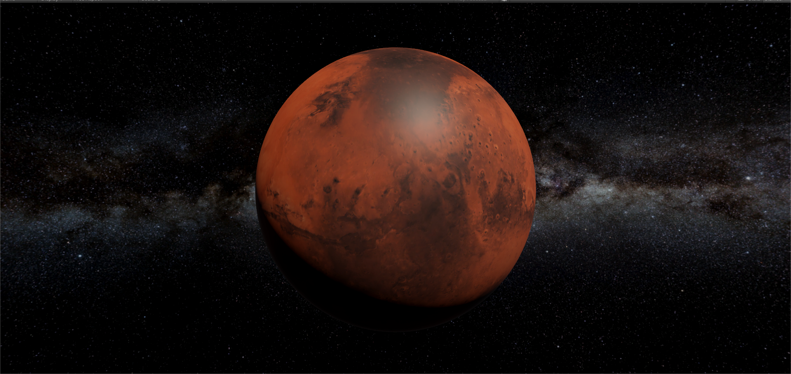

### MarsMap

MarsMap is a 3D visualization application for exploring the surface of Mars with various data layers and interactive tools.

## Technologies Used
- C#
- Unity

## Installation
1. Clone the repository:
   ```bash
   https://github.com/Eli-Zaib/MarsMap.git

## Current Features
- **3D Mars Visualization**
- **Rotation** Allows users to rotate the view around the Mars map.
- **Skybox**
- **Zoom In/Out**

## ScreenShot

  
## Features to Be Implemented
- **Enhanced Camera Control**
- **Advanced Pinning and Annotations**
- **Search Functionality**
- **Data Layers**
- **Land Marks**

